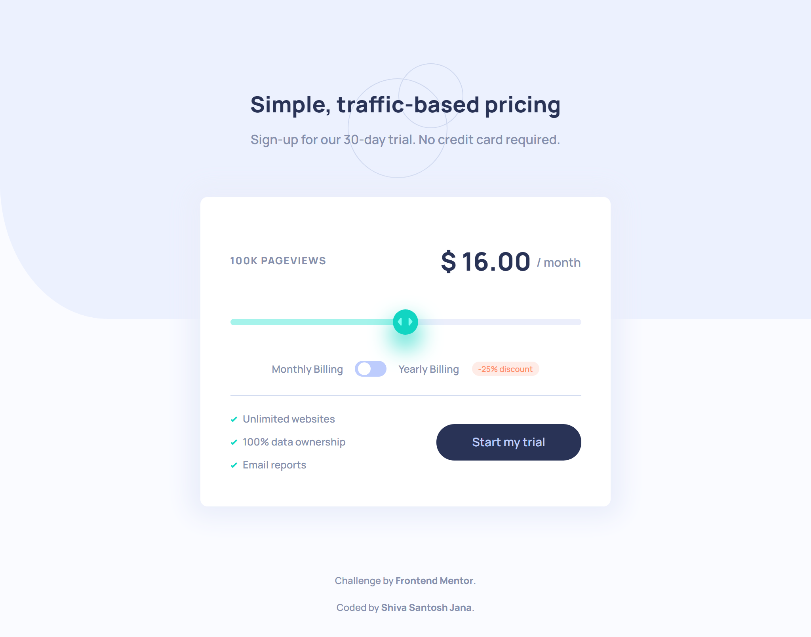
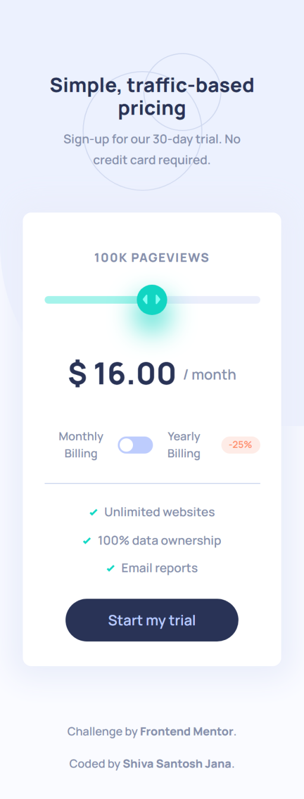

# Frontend Mentor - Interactive pricing component solution

This is a solution to the [Interactive pricing component challenge on Frontend Mentor](https://www.frontendmentor.io/challenges/interactive-pricing-component-t0m8PIyY8). Frontend Mentor challenges help you improve your coding skills by building realistic projects.

## Table of contents

- [Overview](#overview)
  - [The challenge](#the-challenge)
  - [Screenshots](#screenshots)
  - [Links](#links)
- [My process](#my-process)
  - [Built with](#built-with)
  - [What I learned](#what-i-learned)
  - [Continued development](#continued-development)
  - [Useful resources](#useful-resources)
- [Author](#author)

## Overview

### The challenge

Users should be able to:

- View the optimal layout for the app depending on their device's screen size
- See hover states for all interactive elements on the page
- Use the slider and toggle to see prices for different page view numbers

### Screenshots

Desktop version

Tablet version

Mobile version

### Links

- Solution URL: [Code on GitHub](https://github.com/santu369/frontendmentor-interactive-pricing-component)
- Live Site URL: [Netlify Live URL](https://santu369-frontendmentor-interactive-pricing-component.netlify.app/)

## My process

Worked on Mobile first approach, then added media queries, adjusting the layout.
Used Bootstrap and clamp to set font sizes.
Implemented webpack bundler in this project.
Used different configs for dev and prod builds.

### Built with

- Semantic HTML5 markup
- CSS custom properties
- Flexbox
- Mobile-first workflow
- BEM Methodology
- SASS
- CSS Animations
- Bootstrap
- Webpack Bundler

### What I learned

Learned to implement webpack bundler and creating toggle and slider components.
Understanding the concept of shadow dom which we can see in different browsers which are implemented differently. So we need to target them with different selectors specific for each of them. These are supposedly experimental features and not consistent across browers.

Webpack bundler is used for bundling the build files and we can use content hash to make sure our deployment works on a normal reload for the user since content hash changes for deployments based on the content it holds.

Whlie working with Webpack, we need to use a lot of loaders and plugins based on our requirement. I have used a couple of loaders for css and js to be added to the build, some plugins for adding the linking the final html page with css and js fiels.

### Continued development

Will experiment with Gulp task runner and implement it in next project.
Webpack seems to be a little too much for a small project like this one.

### Useful resources

- [Sass](https://sass-lang.com/) - Installing and Learning Sass.
- [BEM](https://en.bem.info/methodology/quick-start/) - Quick Start with BEM.
- [W3C Markup Validation Service](https://validator.w3.org/) - Validator for checking the markup validity of Web documents in HTML, XHTML, SMIL, MathML, etc.
- [W3C CSS Validation Service](https://jigsaw.w3.org/css-validator/) - Check Cascading Style Sheets (CSS) and (X)HTML documents with style sheets.
- [Reset CSS](https://meyerweb.com/eric/tools/css/reset/) - Strips away all the default browser styling.
- [@media>prefers-reduced-motion](https://developer.mozilla.org/en-US/docs/Web/CSS/@media/prefers-reduced-motion) - CSS media feature is used to detect if the user has requested that the system minimize the amount of non-essential motion it uses.
- [Bootstrap CSS](https://getbootstrap.com/docs/5.0/getting-started/introduction/) - Getting started with Bootstrap.
- [Webpack Module Bundler](https://webpack.js.org/) - Static module bundler for modern JavaScript applications.

  - [Webpack loaders](https://webpack.js.org/loaders/) - Loaders are transformations that are applied to the source code of a module. They allow you to pre-process files as you import or “load” them.

    - [svgo-loader](https://www.npmjs.com/package/svgo-loader) - A loader for webpack to pass your SVG files through svgo optimizer. It needs to work with either file-loader or url-loader.
    - [url-loader](https://www.npmjs.com/package/url-loader) - Lets you import arbitrary files, like images.
    - [mini-css-extract-plugin](https://webpack.js.org/plugins/mini-css-extract-plugin/) - Extracts CSS into separate files.
    - [css-loader](https://www.npmjs.com/package/css-loader) - Handles bundling CSS assets.
    - [postcss-loader](https://www.npmjs.com/package/postcss-loader) - tool for transforming styles with JS plugins. These plugins can lint your CSS, support variables and mixins, transpile future CSS syntax (adding vendor prefixes), inline images, and more.
    - [sass-loader](https://www.npmjs.com/package/sass-loader) - Used for compiling SCSS/Sass files.
    - [babel-loader](https://www.npmjs.com/package/babel-loader) - A tool that helps you write code in the latest version of JavaScript. When your supported environments don't support certain features natively, Babel will help you compile those features down to a supported version.

  - [Webpack plugins](https://webpack.js.org/concepts/plugins/) - Plugins can be leveraged to perform a wider range of tasks like bundle optimization, asset management and injection of environment variables.

    - [clean-webpack-plugin](https://www.npmjs.com/package/clean-webpack-plugin) - Plugin to remove/clean your build folder(s).
    - [html-webpack-plugin](https://www.npmjs.com/package/html-webpack-plugin) - Simplifies creation of HTML files to serve your webpack bundles.
    - [mini-css-extract-plugin](https://www.npmjs.com/package/mini-css-extract-plugin) - Extracts CSS into separate files.
    - [HotModuleReplacementPlugin](https://webpack.js.org/plugins/hot-module-replacement-plugin/) - Enables Hot Module Replacement, otherwise known as HMR.

## Author

- Website - [Shiva Santosh Jana](https://santu369.github.io/FreeCodeCamp-PersonalPortfolioWebpage)
- Frontend Mentor - [@santu369](https://www.frontendmentor.io/profile/santu369)
- Twitter - [@santu69](https://www.twitter.com/santu69)
